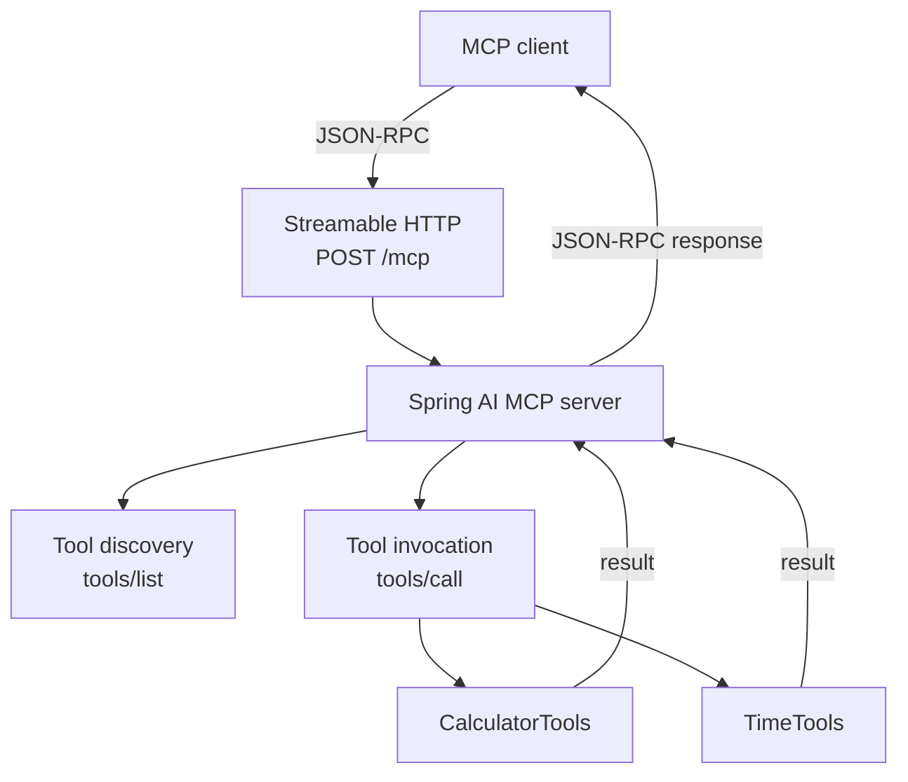

# 01 — MCP Basics: Spring AI MCP Server

A minimal MCP server built with Java 21, Spring Boot, and Spring AI. Its purpose is to make the MCP server lifecycle visible through three small tools—without an LLM, database, RAG, or agent framework.

## Tools

| MCP tool | Input | Result |
| --- | --- | --- |
| `add` | `a`, `b` integers | Their sum |
| `calculateTax` | `amount` | Tax at the fixed 25% demonstration rate |
| `getCurrentTime` | None | Server time as a UTC ISO-8601 timestamp |

`calculateTax` is a programming example, not real tax advice.

## Architecture



## How it works

1. Spring Boot starts `McpBasicsApplication` and creates the application context.
2. Component scanning creates the `CalculatorTools` and `TimeTools` beans.
3. Spring AI scans those beans for `@McpTool` methods.
4. It derives an MCP tool definition and JSON Schema from the Java method signature and `@McpToolParam` metadata.
5. The configured Streamable HTTP transport accepts MCP JSON-RPC messages at `POST /mcp`.
6. When a client sends `tools/list`, it receives the registered tool definitions. When it sends `tools/call`, Spring AI invokes the matching Java method and returns an MCP result.

```text
MCP client
  → Streamable HTTP transport
  → Spring AI MCP server
  → tool discovery or invocation
  → Java method
  → MCP result
  → MCP client
```

## Spring AI versus MCP

MCP defines the protocol concepts: JSON-RPC messages, initialization, `tools/list`, `tools/call`, tool schemas, and the transport contract.

**Spring AI is doing this part for us:**

- Boot auto-configuration creates and configures the MCP server.
- The WebMVC starter wires the Streamable HTTP endpoint.
- Annotation scanning finds `@McpTool` methods on Spring beans.
- Parameter metadata is converted into an MCP JSON Schema.
- Incoming calls are validated, routed to Java methods, and converted into MCP results.

The annotations are Spring AI conveniences; they are not MCP wire-protocol messages themselves.

## Run locally

Prerequisites: Java 21 and Maven.

```bash
cd 01-mcp-basics
mvn test
mvn spring-boot:run
```

The server listens on `http://localhost:8080`. The Streamable HTTP MCP endpoint is `POST /mcp`.

## Example MCP interaction

First, an MCP client initializes a session. The response includes an `Mcp-Session-Id` header; use that value in later requests.

```bash
curl -i -X POST http://localhost:8080/mcp \
  -H 'Content-Type: application/json' \
  -H 'Accept: application/json, text/event-stream' \
  -d '{
    "jsonrpc": "2.0",
    "id": 1,
    "method": "initialize",
    "params": {
      "protocolVersion": "2025-11-25",
      "capabilities": {},
      "clientInfo": { "name": "curl", "version": "1.0.0" }
    }
  }'
```

After sending `notifications/initialized`, list the tools:

```json
{
  "jsonrpc": "2.0",
  "id": 2,
  "method": "tools/list",
  "params": {}
}
```

Invoke `add`:

```json
{
  "jsonrpc": "2.0",
  "id": 3,
  "method": "tools/call",
  "params": {
    "name": "add",
    "arguments": { "a": 7, "b": 5 }
  }
}
```

The result is an MCP response whose text content is `12`.

## Tests

The focused unit tests cover the calculator behavior and ISO-8601 formatting of the time result:

```bash
mvn test
```

## What I learned

- A Spring bean method becomes an MCP tool only after Spring AI discovers its `@McpTool` annotation.
- Java parameters become the client-visible tool input schema; a no-argument method has an empty input object.
- A transport is the delivery mechanism for MCP messages. This project uses Streamable HTTP, not the old SSE transport.
- JSON-RPC correlates each request and response through its `id`; MCP defines the methods and payloads carried in those messages.
- The tool code is ordinary Java. Spring AI supplies the integration layer between those methods and the MCP protocol.

## References

- [Spring AI MCP server documentation](https://docs.spring.io/spring-ai/reference/api/mcp/mcp-server-boot-starter-docs.html)
- [Spring AI Streamable HTTP server documentation](https://docs.spring.io/spring-ai/reference/api/mcp/mcp-streamable-http-server-boot-starter-docs.html)
- [Spring AI MCP annotations](https://docs.spring.io/spring-ai/reference/api/mcp/mcp-annotations-server.html)
